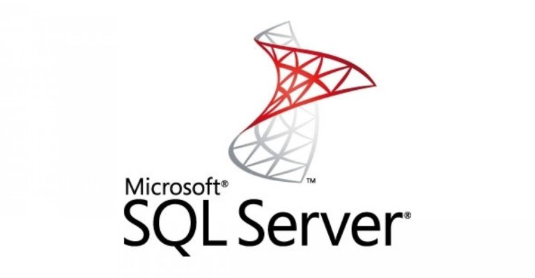

# MSSQL Connector


MSSQL connector is a standalone web server that turns your MSSQL database directly into a RESTful API. The structural constraints and permissions in the database determine the API endpoints and operations.



## Motivation

Using this connector is an alternative to manual CRUD programming. Custom API servers suffer problems. Writing business logic often duplicates, ignores or hobbles database structure. The connector philosophy establishes a single declarative source of truth: the data itself.

## Security
The connector handles authentication (via JSON Web Tokens) and delegates authorization to the role information defined in the database. This ensures there is a single declarative source of truth for security. When dealing with the database the server assumes the identity of the currently authenticated user, and for the duration of the connection cannot do anything the user themselves couldn't. Other forms of authentication can be built on top of the JWT primitive. See the docs for more information.

## Versioning
A robust long-lived API needs the freedom to exist in multiple versions. MSSQL connector does versioning through database schemas. This allows you to expose tables and views without making the app brittle. Underlying tables can be superseded and hidden behind public facing views.

## Self-documentation
MSSQL connector uses the OpenAPI standard to generate up-to-date documentation for APIs. You can use a tool like Swagger-UI to render interactive documentation for demo requests against the live API server.

## Usage Guidelines

### Primary keys
For the endpoints to work against any mssql db tables, it is expected that the table have a primary key defined. 

If not, you will see this error message in the logs when performing any CRUD operations:
````
ArgumentError: Mapper Mapper|SomeTable|SomeTable could not assemble any primary key columns for mapped table 'SomeTable'.
````

In order to fix this, please create or alter your table to have a primary key, like so:

````bash
alter table SomeTable add column id int not null identity(1,1) primary key;
````

## Development
### Build

Install Python 3.7 (or later) on your machine.

Install pipenv

```bash
pip install pipenv
```

To start the virtualenv of the project, run
```
    pipenv shell
```

To install dependencies, run
```
    pipenv install
```

### Running locally

To run the project, simply provide env variables to point the app to a DB backend


```bash
DB_USER=admin DB_PASSWORD=<password> DB_SERVER=localhost DB_NAME=test uvicorn main:app --reload --workers 1 --host 0.0.0.0 --port 8001
```


This will start a worker and expose the API on port `8001` on the host machine.
